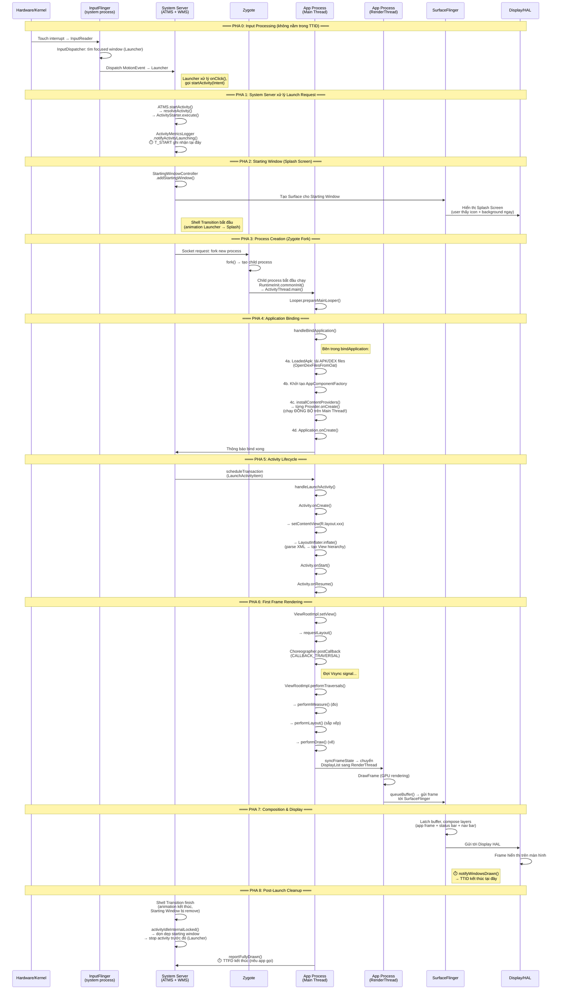

# Nghiên cứu Sâu: FTA & Android App Launching Sequence trong AOSP

---

## Phần A: Luồng Khởi chạy Ứng dụng Android trong AOSP

### 1. Tổng quan: Điểm bắt đầu và kết thúc đo lường

Bạn đúng khi nói rằng thông thường đo từ **touch event** đến **frame đầu tiên hiển thị**, nhưng cần phân biệt rõ vì AOSP thực sự có **nhiều điểm kết thúc khác nhau** và chúng phục vụ mục đích khác nhau:

| Metric | Điểm bắt đầu (Start) | Điểm kết thúc (End) | Ai đo? |
|:---|:---|:---|:---|
| **Input-to-Display Latency** | Touch event tại `InputReader` | Frame chứa phản hồi đầu tiên được hiển thị trên màn hình | Đo thủ công trên Perfetto |
| **TTID (Time to Initial Display)** | `notifyActivityLaunching()` trong `ActivityMetricsLogger` | `notifyWindowsDrawn()` — app's window vẽ frame đầu tiên | System Server (`ActivityMetricsLogger`) |
| **TTFD (Time to Fully Drawn)** | Cùng `notifyActivityLaunching()` | App gọi `reportFullyDrawn()` | App + System Server |
| **Logcat "Displayed"** | Intent tới ActivityManager | Window drawn | `ActivityManager: Displayed com.pkg/.Activity: +XXXms` |

> [!IMPORTANT]
> **Hiểu sai phổ biến:** TTID mà AOSP đo **KHÔNG bắt đầu từ touch event**. Nó bắt đầu từ lúc `ActivityMetricsLogger.notifyActivityLaunching()` được gọi (tức lúc System Server nhận lệnh launch). Khoảng thời gian từ **touch event → input dispatch → Launcher xử lý click → gửi Intent** là một đoạn trễ riêng biệt **không nằm trong TTID**.
>
> Nếu bạn cần đo tổng thể từ ngón tay chạm màn hình, bạn phải tính **Input Latency + TTID** bằng cách tìm `InputReader`/`InputDispatcher` events trên Perfetto.

### 2. Luồng Chi tiết Từ Touch → Display (Cold Start)

Dưới đây là luồng **chính xác** theo AOSP source code, phân rã thành **8 pha** trải trên **4 tiến trình** khác nhau:



### 3. Giải thích Chi tiết Từng Pha

#### Pha 0: Input Processing (KHÔNG nằm trong TTID)
- **Kernel → InputReader:** Driver touchscreen phát ra interrupt, InputReader đọc raw event
- **InputDispatcher:** Xác định cửa sổ nào đang focus (thường là Launcher), gửi `MotionEvent` tới Launcher process
- **Launcher:** Nhận touch event → xử lý `onClick()` → gọi `startActivity(Intent)`
- ⚠️ **Khoảng thời gian này thường 30–80ms** và KHÔNG được tính trong TTID/Displayed metric

#### Pha 1: ATMS xử lý Launch Request
- `ActivityTaskManagerService.startActivity()` → resolve Intent, kiểm tra permissions
- `ActivityStarter.execute()` → tạo `ActivityRecord`, quyết định Task/Stack
- **`ActivityMetricsLogger.notifyActivityLaunching()`** → **⏱️ ĐÂY LÀ ĐIỂM BẮT ĐẦU CỦA TTID**

#### Pha 2: Starting Window (Splash Screen)
- AOSP 12+ sử dụng `SplashScreen` API tự động tạo Starting Window
- Window này hiển thị **trước khi app process tồn tại** → feedback trực quan ngay lập tức
- Shell Transition bắt đầu: animation chuyển từ Launcher → Starting Window

#### Pha 3: Zygote Fork
- System Server gửi request tới Zygote qua Unix socket (`/dev/socket/zygote`)
- Zygote `fork()` → child process kế thừa toàn bộ preloaded classes và resources
- **Đây là giai đoạn duy nhất chạy ngoài cả System Server và App process**

#### Pha 4: bindApplication ← **Giai đoạn nặng nhất cho Cold Start**
Thứ tự thực hiện **trên Main Thread**, tuần tự, không thể song song:

```
handleBindApplication()
  ├── 4a. Tải APK: LoadedApk.makeApplication()
  │       └── Dex file loading (OpenDexFilesFromOat)
  │       └── JIT compilation hoặc interpret (nếu chưa AOT)
  ├── 4b. AppComponentFactory.instantiateApplication()
  ├── 4c. installContentProviders()           ← NGUY HIỂM
  │       ├── Provider_1.onCreate()           ← đồng bộ
  │       ├── Provider_2.onCreate()           ← đồng bộ
  │       └── ... (Firebase, WorkManager, v.v.)
  └── 4d. Application.onCreate()             ← app code
          ├── SDK init (analytics, crash reporting)
          ├── DI framework init (Dagger/Hilt)
          └── Database init, SharedPreferences read
```

> [!WARNING]
> **ContentProviders chạy TRƯỚC Application.onCreate()!** Nhiều thư viện (Firebase, WorkManager, Facebook SDK) tự đăng ký ContentProvider trong Manifest để tự khởi chạy mà developer không biết. Trên Android 16/17, AndroidX `App Startup` library giúp kiểm soát thứ tự này.

#### Pha 5: Activity Lifecycle
- AOSP Android 14+ sử dụng `ClientTransaction` gộp nhiều lifecycle callback thành một giao dịch IPC duy nhất
- `LaunchActivityItem` → `Activity.onCreate()` → `Activity.onStart()` → `ResumeActivityItem` → `Activity.onResume()`
- `setContentView()` thực hiện `LayoutInflater.inflate()` — parse XML layout file → tạo View tree

#### Pha 6: First Frame Rendering
- Sau `onResume()`, `ViewRootImpl` đăng ký callback với `Choreographer`
- Khi nhận Vsync signal, `performTraversals()` chạy:
  - `performMeasure()` → tính toán kích thước từng View
  - `performLayout()` → xác định vị trí từng View
  - `performDraw()` → ghi Display List (recording commands)
- **RenderThread** nhận Display List, thực hiện GPU rendering → tạo ra buffer
- Buffer được gửi tới SurfaceFlinger qua `queueBuffer()`

#### Pha 7: Composition & Display
- SurfaceFlinger compose tất cả layers (app + system UI + navigation bar)
- Gửi frame hoàn chỉnh tới Display HAL
- **`notifyWindowsDrawn()`** được gọi → **⏱️ TTID KẾT THÚC TẠI ĐÂY**

#### Pha 8: Post-Launch Cleanup & activityIdle

> [!IMPORTANT]
> **Về `activityIdle` — Giải đáp câu hỏi của bạn:**
>
> `activityIdleInternalLocked()` được gọi khi Main Thread của app đã xử lý xong hàng đợi tin nhắn ban đầu (Looper idle). Nó **KHÔNG phải là điểm kết thúc của TTID**. Nó là điểm cleanup:
> - Xóa Starting Window (nếu chưa xóa)
> - Gọi `Activity.onStop()` cho activity cũ (Launcher)
> - Dọn dẹp transition resources
>
> **Thứ tự chính xác:**
> 1. `notifyWindowsDrawn()` → TTID kết thúc (frame đầu tiên vẽ xong)
> 2. Shell Transition animation kết thúc (Starting Window → App Window)
> 3. `activityIdleInternalLocked()` → cleanup
> 4. `reportFullyDrawn()` → TTFD kết thúc (nếu app gọi, có thể rất muộn)
>
> Vì vậy, **animation của system/launcher kết thúc SAU TTID nhưng TRƯỚC activityIdle**. `activityIdle` thường xảy ra 1-2 frame sau khi animation kết thúc.

### 4. Bản đồ Slice Names trên Perfetto/Systrace

| Pha | Slice Name trên Systrace/Perfetto | Tiến trình |
|:---|:---|:---|
| 0 | `InputReader`, `InputDispatcher`, `deliverInputEvent` | `InputFlinger` / Launcher |
| 1 | `startActivityInner`, `ActivityStarter` | `system_server` |
| 2 | `addStartingWindow`, `ShellTransition` (A14+) | `system_server` / `SystemUI` |
| 3 | `Start proc: <pkg>`, `PostFork` | `system_server` → `Zygote` |
| 4 | `bindApplication` (chứa `installProvider`, `ContentProvider.onCreate`, `Application.onCreate`) | App Main Thread |
| 5 | `activityStart` / `executeTransaction`, `performLaunchActivity`, `inflate` | App Main Thread |
| 6 | `Choreographer#doFrame`, `performTraversals`, `measure`, `layout`, `draw`, `Record View#draw()` | App Main Thread |
| 6 | `DrawFrame`, `syncFrameState`, `queueBuffer` | App RenderThread |
| 7 | `onMessageReceived`, `INVALIDATE` | `SurfaceFlinger` |
| 8 | `activityIdle`, `removeStartingWindow` | `system_server` |

---

## Phần B: Phương pháp FTA theo Chuẩn IEC 61025

### 1. Định nghĩa Chuẩn

**Fault Tree Analysis (IEC 61025:2006)** là phương pháp phân tích **suy diễn (deductive), từ trên xuống (top-down)**, sử dụng cấu trúc logic dạng cây để xác định **tất cả các tổ hợp sự kiện** có thể dẫn đến một **sự kiện đỉnh (Top Event)** không mong muốn.

### 2. Các Thành phần Chuẩn

| Ký hiệu | Tên | Mô tả |
|:---|:---|:---|
| ▢ | **Top Event** | Sự kiện không mong muốn ở đỉnh cây |
| ○ | **Basic Event** | Sự kiện cơ bản ở lá cây, không cần phân tích thêm |
| ◇ | **Undeveloped Event** | Sự kiện chưa được phân tích sâu hơn (thiếu dữ liệu) |
| △ | **Transfer Gate** | Tham chiếu sang nhánh khác trong cây |
| ⊞ (OR) | **Cổng OR** | Đầu ra xảy ra nếu **ít nhất 1** đầu vào xảy ra |
| ⊠ (AND) | **Cổng AND** | Đầu ra xảy ra nếu **tất cả** đầu vào đồng thời xảy ra |
| ⊠ (k/n) | **Cổng VOTING** | Đầu ra xảy ra nếu **k trong n** đầu vào xảy ra |
| ⊞ (INHIBIT) | **Cổng INHIBIT** | Đầu ra xảy ra nếu đầu vào xảy ra **VÀ** điều kiện cho phép (condition) đúng |

### 3. Phân tích Định tính: Minimal Cut Sets (MCS)

**Tập cắt (Cut Set):** Tập hợp các sự kiện cơ bản mà nếu **tất cả** xảy ra đồng thời → Top Event xảy ra.

**Tập cắt tối thiểu (Minimal Cut Set):** Cut Set nhỏ nhất — không thể bỏ bớt bất kỳ sự kiện nào mà vẫn gây ra Top Event.

**Ý nghĩa:**
- MCS bậc 1 (chỉ 1 sự kiện) → **Single Point of Failure** → nguy hiểm nhất
- MCS bậc 2 (cần 2 sự kiện đồng thời) → ít nguy hiểm hơn
- Số lượng MCS bậc thấp càng nhiều → hệ thống càng dễ tổn thương

### 4. Áp dụng FTA cho Phân tích Hiệu năng (Performance FTA)

Khi chuyển đổi FTA từ phân tích an toàn sang phân tích **trễ phần mềm**, ta thay đổi ngữ nghĩa nhưng giữ nguyên cấu trúc:

| Khái niệm FTA chuẩn | Chuyển đổi sang Performance FTA |
|:---|:---|
| Top Event: "Hệ thống hỏng" | Top Event: "App Launch Time > ngưỡng N ms so với REF" |
| Basic Event: "Linh kiện hỏng" | Basic Event: "Giai đoạn X trễ > ngưỡng M ms" |
| Failure Rate ($\lambda$) | Delta thời gian đo được ($\Delta T_{DUT} - \Delta T_{REF}$) |
| Cổng OR: "Hỏng nếu bất kỳ thành phần nào hỏng" | Cổng OR: "Trễ nếu bất kỳ giai đoạn nào trễ" |
| Cổng AND: "Hỏng chỉ khi cả hai cùng hỏng" | Cổng AND: "Trễ chỉ khi cả hai điều kiện đồng thời đúng" (ví dụ: CPU throttling **VÀ** I/O contention) |

> [!TIP]
> **Sự khác biệt quan trọng nhất:** Trong FTA an toàn, cổng AND rất phổ biến (hệ thống redundancy). Trong Performance FTA, **cổng OR** chiếm đa số vì bất kỳ giai đoạn nào trễ đều làm tăng tổng thời gian (chúng nằm trên đường nối tiếp — serial path). Cổng AND chỉ xuất hiện khi phân tích **nguyên nhân** tại sao một giai đoạn cụ thể trễ (ví dụ: "CPU frequency thấp" AND "app chạy trên LITTLE core").

### 5. Cây FTA Đúng Chuẩn cho Android App Launch Delay

Dựa trên hiểu biết chính xác về AOSP launching sequence ở Phần A, cây FTA chuẩn cần có **cấu trúc phân cấp (hierarchical)** với cả OR và AND gates:

```
TOP EVENT: "Cold Start trên DUT chậm hơn REF > 100ms"
│
└── OR ─── IE1: "Trễ tại Input → System Server"
│            └── OR ─── BE: Input dispatch chậm (touch latency cao)
│                        BE: Launcher onClick() xử lý lâu
│
├── OR ─── IE2: "Trễ tại Zygote Fork"
│            └── OR ─── BE: CPU starvation (nhân lớn không sẵn sàng)
│                        AND ── BE: Hệ thống thiếu RAM
│                               BE: LMK đang chạy giải phóng
│
├── OR ─── IE3: "Trễ tại bindApplication"
│            └── OR ─── IE3a: "Dex/Class Loading chậm"
│                        │       └── OR ── BE: App chưa AOT compiled
│                        │                  BE: Dex file lớn, I/O flash chậm
│                        │
│                        IE3b: "Content Providers Init chậm"
│                        │       └── OR ── BE: SDK Provider chạy I/O trên Main Thread
│                        │                  BE: Database init đồng bộ
│                        │
│                        IE3c: "Application.onCreate() chậm"
│                                └── OR ── BE: DI framework init nặng
│                                           BE: SDK analytics init trên Main Thread
│                                           AND ── BE: SharedPreferences đọc file lớn
│                                                  BE: File trên flash chậm (I/O contention)
│
├── OR ─── IE4: "Trễ tại Activity Lifecycle"
│            └── OR ─── BE: Layout inflation phức tạp (XML sâu nhiều lớp)
│                        BE: Custom View constructor nặng
│                        BE: onCreate() chạy DB query đồng bộ
│
├── OR ─── IE5: "Trễ tại First Frame Rendering"
│            └── OR ─── BE: Measure/Layout chạy nhiều pass
│                        BE: Draw phức tạp (custom drawing, bitmap decode)
│                        AND ── BE: RenderThread bận (GPU bottleneck)
│                               BE: SurfaceFlinger composition chậm
│
└── OR ─── IE6: "Trễ cấp Hệ thống (xuyên suốt)"
             └── OR ─── AND ── BE: ADPF boost không hoạt động
                               BE: App chạy trên LITTLE cores
                        BE: GC (Garbage Collection) chạy trên Main Thread
                        BE: Binder transaction block (IPC với System Server)
                        AND ── BE: CPU frequency thấp (thermal throttling)
                               BE: Tải hệ thống cao (nhiều app chạy nền)
```

**Chú thích:**
- `BE` = Basic Event (sự kiện cơ bản — lá cây)
- `IE` = Intermediate Event (sự kiện trung gian)
- `OR` = Bất kỳ con nào xảy ra → cha xảy ra
- `AND` = Tất cả con phải đồng thời xảy ra → cha mới xảy ra

---

## Phần C: So sánh Thiết kế FTA Hiện tại vs FTA Chuẩn

| Khía cạnh | FTA hiện tại trong script | FTA chuẩn IEC 61025 |
|:---|:---|:---|
| **Cấu trúc** | Phẳng (flat) — tất cả nhánh là con trực tiếp của Top Event | Phân cấp (hierarchical) — có Intermediate Events |
| **Loại cổng** | Chỉ OR (tất cả nhánh là `if` độc lập) | OR + AND + INHIBIT |
| **Cổng AND** | Không có | Cần cho: CPU freq thấp + app trên LITTLE core, RAM thấp + LMK chạy |
| **Pha 0 (Input)** | Không đo | Cần bổ sung nếu đo end-to-end |
| **Pha 6-7 (Render)** | Trích xuất metric nhưng không đánh giá trong FTA | Cần thêm nhánh IE5 |
| **Pha 8 (activityIdle)** | Không đo | Có thể thêm như Undeveloped Event (◇) |
| **Minimal Cut Sets** | Không tính | Nên tính để xác định Single Points of Failure |
| **Severity** | Tính nhưng không dùng | Cần hiển thị trong báo cáo |
| **Cổng Fallback** | Chỉ kích hoạt khi KHÔNG có nhánh nào bắn | Không có khái niệm "fallback" trong FTA chuẩn — mọi nhánh đều được đánh giá |

> [!CAUTION]
> **Vấn đề nghiêm trọng nhất:** FTA hiện tại sử dụng `not reasons` để quyết định fallback. Trong FTA chuẩn, **mọi nhánh luôn được đánh giá** — không có khái niệm "nhánh chỉ kiểm tra khi các nhánh khác không bắn". Điều này cần được sửa lại.
