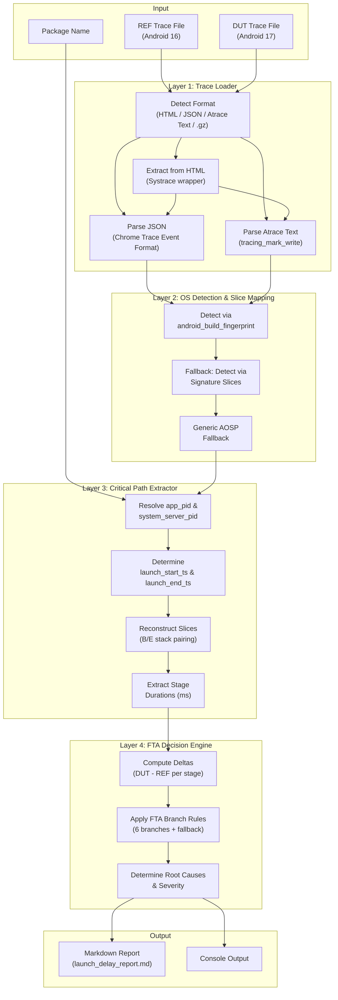
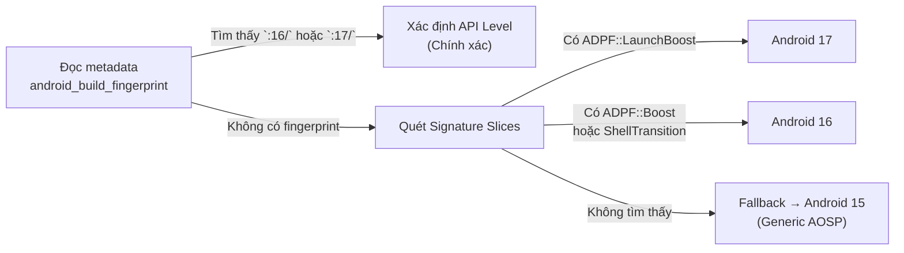
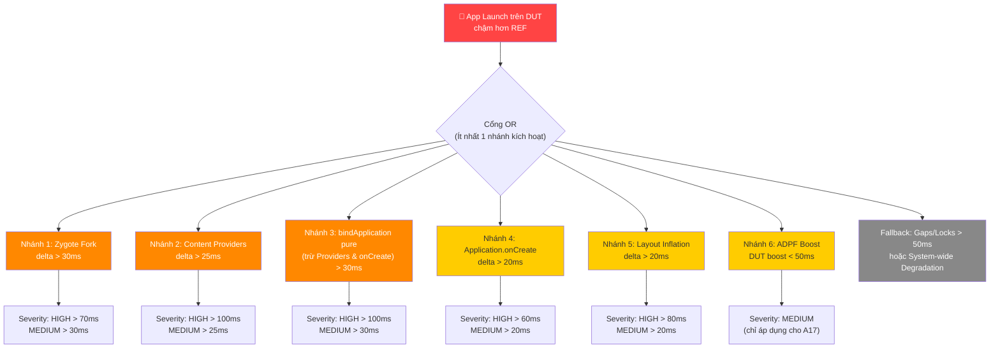
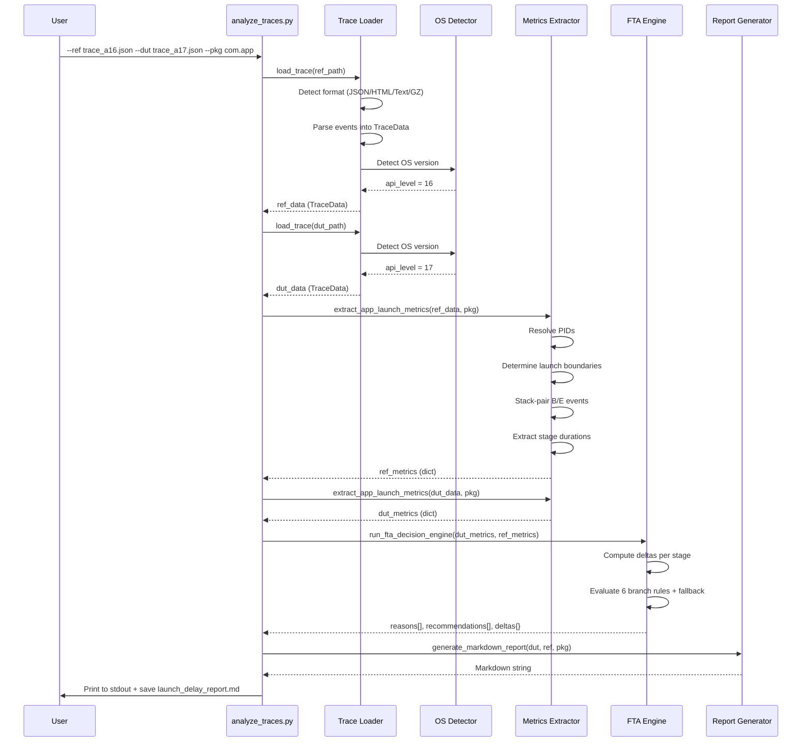

# Tổng quan Hệ thống: Phân tích Tự động Trễ Khởi chạy Android App bằng FTA

---

## 1. Mục tiêu Hệ thống

Hệ thống nhận vào **hai file Systrace/Perfetto trace** (một từ DUT chạy Android 17, một từ REF chạy Android 16), tự động:
1. Nhận diện phiên bản OS của từng trace
2. Trích xuất các mốc thời gian trên đường đi găng (Critical Path) của quá trình khởi chạy ứng dụng
3. Áp dụng mô hình Cây Lỗi (Fault Tree Analysis) để xác định nhánh nguyên nhân gốc rễ
4. Xuất báo cáo Markdown cuối cùng với bảng so sánh, kết luận và đề xuất khắc phục

**Không yêu cầu tương tác con người** trong toàn bộ quy trình — chỉ cần cung cấp đường dẫn file trace và package name.

---

## 2. Kiến trúc Tổng thể



---

## 3. Chi tiết Các Tầng (Layers)

### 3.1 Layer 1: Trace Loader — [load_trace()](file:///home/avada/.gemini/antigravity/scratch/analyze_traces.py#L180-L253)

Chịu trách nhiệm đọc file trace từ đĩa và chuyển đổi thành cấu trúc dữ liệu nội bộ `TraceData`.

| Định dạng đầu vào | Cách xử lý | Hàm xử lý |
|:---|:---|:---|
| `.json` (Chrome Trace Event) | Parse trực tiếp JSON, đọc mảng `traceEvents` | [parse_json_trace()](file:///home/avada/.gemini/antigravity/scratch/analyze_traces.py#L60-L110) |
| `.html` (Systrace HTML wrapper) | Trích xuất nội dung trace từ tag `<script class="trace-data">` rồi tiếp tục parse | [parse_html_trace()](file:///home/avada/.gemini/antigravity/scratch/analyze_traces.py#L27-L58) |
| Plain text (Atrace/ftrace) | Parse từng dòng regex `tracing_mark_write: B\|pid\|name` | [parse_atrace_text()](file:///home/avada/.gemini/antigravity/scratch/analyze_traces.py#L112-L178) |
| `.gz` (Compressed) | Giải nén gzip trước, rồi thử JSON hoặc Atrace text | Xử lý trong `load_trace()` |

**Cấu trúc dữ liệu nội bộ:**

```python
class TraceEvent:
    name: str       # Tên slice (ví dụ: "bindApplication")
    ts: float       # Timestamp (microseconds)
    phase: str      # 'B' (Begin), 'E' (End), 'X' (Complete), 'C' (Counter), 'M' (Metadata)
    pid: int        # Process ID
    tid: int        # Thread ID
    dur: float      # Duration (chỉ dùng cho phase 'X')
    args: dict      # Các tham số bổ sung

class TraceData:
    events: list[TraceEvent]    # Danh sách sự kiện đã sắp xếp theo timestamp
    process_names: dict         # pid -> tên tiến trình (ví dụ: "com.example.app")
    thread_names: dict          # tid -> tên luồng (ví dụ: "RenderThread")
    metadata: dict              # Siêu dữ liệu (fingerprint, device_properties)
    api_level: int              # Phiên bản Android đã phát hiện (16, 17, hoặc 15 fallback)
```

### 3.2 Layer 2: OS Detection & Fallback

Thực hiện phát hiện phiên bản Android theo 3 cấp độ ưu tiên:



> [!NOTE]
> Hiện tại hệ thống sử dụng regex `:(\\d+)/` trên chuỗi fingerprint. Định dạng fingerprint thực tế có dạng `google/shiba/shiba:16/WPP1.../...` nên regex này hoạt động tốt. Tuy nhiên, nếu OEM tùy biến fingerprint khác đi (ví dụ bỏ dấu `:` trước số phiên bản), sẽ rơi vào logic fallback.

### 3.3 Layer 3: Critical Path Extractor — [extract_app_launch_metrics()](file:///home/avada/.gemini/antigravity/scratch/analyze_traces.py#L256-L478)

Đây là tầng phức tạp nhất, chịu trách nhiệm **trích xuất chính xác các mốc thời gian** trên đường đi găng của Main Thread. Luồng xử lý:

#### Bước 3.1: Xác định PID của App và System Server

```
Ưu tiên 1: Tra cứu process_names dict (từ metadata "M" events)
Ưu tiên 2: Tìm event "bindApplication" → lấy pid từ event đó
Ưu tiên 3: Tìm thread có tên "ActivityManager" hoặc "ActivityTaskManager"
```

#### Bước 3.2: Xác định Ranh giới Khởi chạy (Launch Boundaries)

| Mốc | Cách xác định | Fallback |
|:---|:---|:---|
| **launch_start_ts** | Event `activityStart` hoặc `startActivity` từ system_server | Event `B` đầu tiên trên app_pid trừ 50ms |
| **launch_end_ts** | Event `Choreographer#doFrame` hoặc `draw` đầu tiên **sau** `bindApplication` | Event `activityResume` hoặc `performTraversals` |

#### Bước 3.3: Tái tạo Slice bằng Stack Pairing

Với mỗi thread, duy trì một ngăn xếp (stack) để ghép cặp sự kiện `B` (Begin) và `E` (End):

```
Stack[tid]:  push(name, ts) khi gặp 'B'
             pop() khi gặp 'E' → tính dur = ts_end - ts_start
             → Thêm vào completed_slices[(tid, name, start, end, dur)]

Với event 'X' (Complete): dur đã có sẵn trong event, thêm trực tiếp.
```

#### Bước 3.4: Trích xuất Metrics theo Giai đoạn

| Giai đoạn | Cách tính | Đơn vị |
|:---|:---|:---|
| **Zygote Fork** | `bindApplication.start_ts - launch_start_ts` | ms |
| **bindApplication** | Duration của slice `bindApplication` | ms |
| **Content Providers** | Tổng duration các slice `ContentProvider.onCreate` / `userProviderInit` nằm trong `bindApplication` | ms |
| **Application.onCreate** | Duration của slice `Application.onCreate` nằm trong `bindApplication` | ms |
| **Activity Lifecycle** | Max duration trong các slice `activityStart`, `executeTransaction`, `performLaunchActivity` | ms |
| **Layout Inflation** | Tổng duration các slice `inflate` | ms |
| **Measure & Layout** | Tổng duration các slice `measure` + `layout` (loại trừ `performTraversals` tránh trùng) | ms |
| **Draw & Render** | Duration `draw` trên UI thread + `DrawFrame`/`syncFrameState` trên RenderThread | ms |
| **ADPF Boost** | Duration của slice `ADPF::LaunchBoost` (A17) hoặc `ADPF::Boost` (A16) | ms |
| **Gaps & Locks** | `overall_launch - (zygote + bind + lifecycle + measure + draw)` | ms |

### 3.4 Layer 4: FTA Decision Engine — [run_fta_decision_engine()](file:///home/avada/.gemini/antigravity/scratch/analyze_traces.py#L480-L592)

Áp dụng mô hình Cây Lỗi (Fault Tree) để xác định nguyên nhân gốc rễ dựa trên giá trị delta giữa DUT và REF.



**Logic quyết định:**

| Nhánh | Điều kiện kích hoạt | Ngưỡng Severity |
|:---|:---|:---|
| 1. Zygote Fork | `delta["zygote_fork"] > 30ms` | HIGH: >70ms, MEDIUM: >30ms |
| 2. Providers | `delta["providers_init"] > 25ms` | HIGH: >100ms, MEDIUM: >25ms |
| 3. Dex/Runtime | `bind_pure_delta > 30ms` (bind - providers - onCreate) | HIGH: >100ms, MEDIUM: >30ms |
| 4. App onCreate | `delta["app_create"] > 20ms` | HIGH: >60ms, MEDIUM: >20ms |
| 5. Layout Inflation | `delta["layout_inflation"] > 20ms` | HIGH: >80ms, MEDIUM: >20ms |
| 6. ADPF Boost | `api_level == 17 AND adpf_boost < 50ms` | MEDIUM |
| Fallback | Không có nhánh nào kích hoạt AND `overall_delta > 50ms` | Kiểm tra Gaps hoặc System-wide |

> [!IMPORTANT]
> Nhiều nhánh có thể kích hoạt **đồng thời** (cổng OR). Báo cáo sẽ liệt kê **tất cả** các nguyên nhân được phát hiện cùng lúc, không chỉ một.

---

## 4. Luồng Thực thi End-to-End



---

## 5. Cấu trúc File Dự án

```
/home/avada/.gemini/antigravity/scratch/
├── analyze_traces.py          # Script chính (730 dòng) — Toàn bộ pipeline
├── generate_mock_traces.py    # Script tạo dữ liệu trace giả lập để kiểm thử
├── ref_trace.json             # Trace giả lập Android 16 (REF)
├── dut_trace.json             # Trace giả lập Android 17 (DUT)
└── launch_delay_report.md     # Báo cáo kết quả phân tích mẫu
```

---

## 6. Mẫu Báo cáo Đầu ra (Output Report)

Báo cáo cuối cùng gồm 4 phần:

| Phần | Nội dung |
|:---|:---|
| **§1. Overall Launch Time** | Bảng so sánh tổng thời gian DUT vs REF, với icon trạng thái (🔴/🟡/🟢) |
| **§2. Critical Path Breakdown** | Bảng phân rã 9 giai đoạn + ADPF, mỗi hàng có REF(ms), DUT(ms), Delta, Đánh giá FTA (❌/⚠️/✅/✓) |
| **§3. Root Cause Analysis** | Danh sách các nguyên nhân gốc rễ đã kích hoạt từ FTA Decision Engine, mô tả bằng tiếng Việt |
| **§4. Recommendations** | Danh sách đề xuất khắc phục cụ thể, khả thi, ánh xạ 1:1 với từng nguyên nhân |

---

## 7. Các Hạn chế Hiện tại và Đề xuất Cải tiến

> [!WARNING]
> ### Hạn chế cần lưu ý

| # | Hạn chế | Mức độ ảnh hưởng | Chi tiết |
|:---|:---|:---|:---|
| 1 | **Không hỗ trợ Perfetto protobuf binary** (`.perfetto-trace`, `.pftrace`) | 🔴 Cao | Script chỉ parse được JSON và Atrace text. File trace từ `perfetto` CLI mặc định xuất protobuf binary, cần chuyển đổi trước bằng `traceconv` hoặc tích hợp thư viện `perfetto` Python. |
| 2 | **Phát hiện app_pid bằng sampling 1000 events đầu** | 🟡 Trung bình | Dòng `any(e.tid == tid and e.pid == app_pid for e in events[:1000])` chỉ kiểm tra 1000 event đầu. Với trace lớn (>100K events), thread khởi tạo muộn có thể bị bỏ sót. |
| 3 | **Chưa phân tích Thread State (Runnable/Sleeping/D-state)** | 🟡 Trung bình | Hiện chỉ tính "Gaps & Locks" bằng phép trừ, chưa phân tích trực tiếp trạng thái CPU scheduling (`sched_switch`, `sched_wakeup`) để xác định chính xác lý do block. |
| 4 | **Chưa phân tích CPU Frequency** | 🟡 Trung bình | Không đọc counter event `cpufreq` để so sánh tần số CPU giữa DUT và REF trong suốt quá trình launch. |
| 5 | **Ngưỡng FTA cố định (hardcoded thresholds)** | 🟢 Thấp | Các ngưỡng kích hoạt nhánh FTA (30ms, 25ms, 20ms...) được hardcode, chưa có cơ chế điều chỉnh theo loại thiết bị hoặc loại app. |
| 6 | **Chưa hỗ trợ multiple launch events** | 🟢 Thấp | Nếu trace chứa nhiều lần launch app (ví dụ cold → kill → warm), script chỉ lấy lần đầu tiên. |
| 7 | **OS Detection Signature Slices chưa được xác minh trên AOSP thật** | 🟡 Trung bình | Các slice name như `ADPF::LaunchBoost`, `ShellTransition` được suy luận từ tài liệu AOSP, chưa xác minh trên trace thật từ thiết bị Android 16/17. |

> [!TIP]
> ### Đề xuất Cải tiến (Roadmap)

| Ưu tiên | Cải tiến | Mô tả |
|:---|:---|:---|
| **P0** | Tích hợp `traceconv` hoặc Perfetto Python SDK | Cho phép đọc trực tiếp file `.perfetto-trace` binary bằng cách tự động gọi `traceconv json <input>` hoặc dùng `perfetto.trace_processor.TraceProcessor` |
| **P0** | Xác minh slice names trên trace thật | Thu thập trace từ thiết bị Android 16 và 17 thật, xác nhận tên slice chính xác và cập nhật mapping |
| **P1** | Phân tích Thread State (sched) | Parse `sched_switch` events để xác định thời gian Main Thread ở trạng thái `Running`, `Runnable` (CPU starved), `Sleeping` (Lock), `Uninterruptible Sleep` (I/O) |
| **P1** | Phân tích CPU Frequency | Đọc counter events `cpu_frequency` để phát hiện thermal throttling trên DUT |
| **P1** | Xây PID lookup cache | Thay thế linear scan `events[:1000]` bằng dict `{tid: pid}` xây sẵn trong lúc parse |
| **P2** | Cấu hình ngưỡng FTA từ file config | Cho phép người dùng tùy chỉnh ngưỡng kích hoạt (threshold) cho từng nhánh FTA qua file YAML/JSON |
| **P2** | Hỗ trợ phân tích nhiều lần launch | Phát hiện và tách nhiều launch session trong cùng một trace, phân tích riêng biệt |
| **P3** | Xuất báo cáo HTML tương tác | Tạo báo cáo HTML có biểu đồ thanh (bar chart) so sánh trực quan từng giai đoạn |

---

## 8. Cách sử dụng

```bash
# Cú pháp cơ bản
python3 analyze_traces.py \
  --ref <path_to_android16_trace> \
  --dut <path_to_android17_trace> \
  --pkg <app_package_name>

# Ví dụ thực tế
python3 analyze_traces.py \
  --ref ./pixel8_a16_youtube_coldstart.json \
  --dut ./pixel9_a17_youtube_coldstart.json \
  --pkg com.google.android.youtube
```

**Các định dạng file trace được hỗ trợ:**
- `*.json` — Chrome Trace Event Format (xuất từ Perfetto UI "Export as JSON")
- `*.html` — Systrace HTML report (xuất từ `python systrace.py`)
- `*.txt` — Atrace raw text (xuất từ `atrace --async_dump`)
- `*.gz` — Bất kỳ định dạng trên nhưng nén gzip

> [!CAUTION]
> File `.perfetto-trace` (protobuf binary) **chưa được hỗ trợ**. Cần chuyển đổi trước:
> ```bash
> traceconv json input.perfetto-trace output.json
> ```
